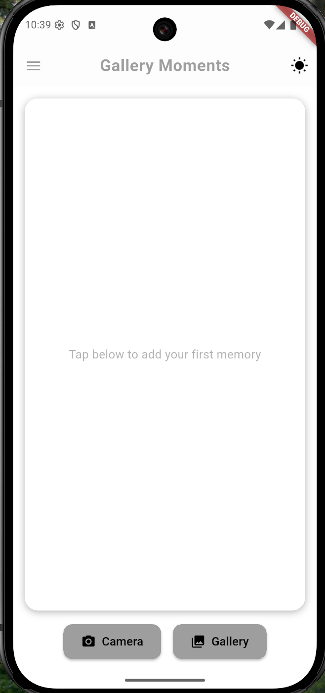
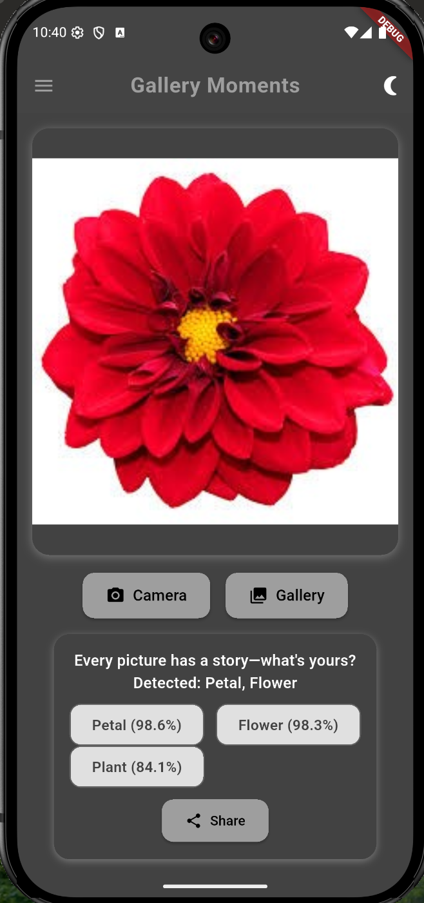
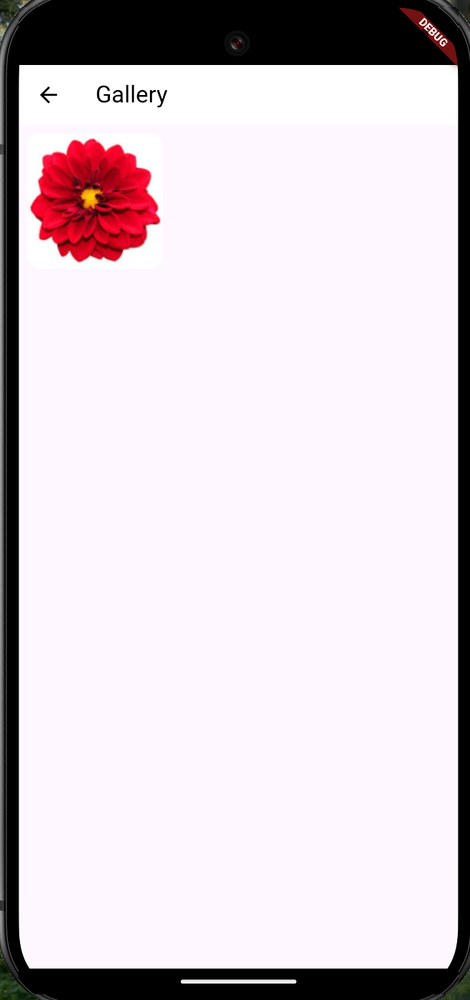
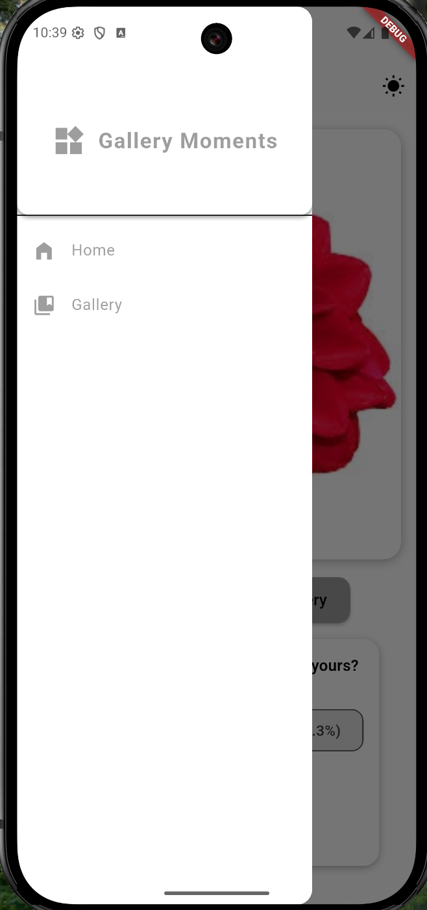

# Gallery Moments

**Name:** Selssabil Medghaghet  
**Matricola:** 337435  
**Exam Session:** 17-08-2025

## Project Title
Gallery Moments – Smart Image Picker with Captioning and ML Labeling

## Overview
Gallery Moments is a Flutter mobile app that allows users to take or select images, automatically label them using Google ML Kit, and generate fun, meaningful captions. Users can manage a gallery of images, delete with undo, toggle between light/dark themes, and share both image and caption. It’s designed to feel simple and modern on both small and large screens.

## User Experience
- Tap **Camera** or **Gallery** to add an image.
- The app auto-labels it and creates a smart caption.
- View your image gallery in the drawer.
- Swipe to delete an image, with option to undo.
- Share the image + caption easily from the main screen.
- Toggle between light and dark mode in the AppBar.

### Screenshots

## Technology & Implementation

### Packages Used
- `google_mlkit_image_labeling`: for detecting labels in images.
- `image_picker`: for capturing images via camera or gallery.
- `share_plus`: to share images and generated captions.
- `provider`: to handle app state cleanly (theme, gallery).

### Implementation Notes
- Undo logic for image deletion is handled by caching the last removed item.
- Duplicate images are prevented by checking file paths before insertion.
- Theme is managed globally with `ThemeProvider` using `ChangeNotifier`.
- UI adjusts based on screen size using `MediaQuery` and responsive layouts.
- Snackbar is used effectively for undo actions and feedback.

---

**GitHub Repository:**  
[https://github.com/medselsabil/image_caption](https://github.com/medselsabil/image_caption)
